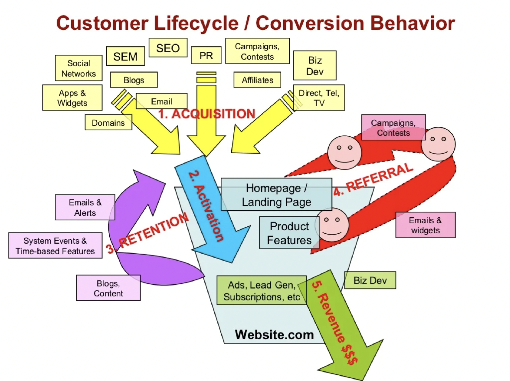

# AARRR: Dave McClure's Pirate Metrics

- **Acquisition**: How do potential customers get to know us??
	- SEO
	- Social media
	- Marketing campaigns
	- Apps and widgets
	- Advertising 

- **Activation**: How many customers are satisfied with their shopping experience?
	- Visiting additional pages
	- Experimenting with additional features
	- Spending a given amount of time on your site or app
	- Signing up for your newsletter
	- Signing up for your free trial

- **Referral**: How many customers suggest that other people should consider your business?
	- Emails with referral promotions embedded
	- Referral contests
	- Other marketing campaigns designed to make it easy to share the product with others

- **Retention**: How many customers return?
	- Returning to your product repeatedly over a given timeframe
	- Returning to your website
	- Opening your company’s emails
	- Signing up for your RSS feed

- **Revenue**: How much money does each customer bring to the business?
	- Minimum revenue
	- Break-even revenue
	- Revenue that exceeds the customer acquisition cost

	
## References

[1] Dave McClure: Startup Metrics for Pirates [Slides](https://www.slideshare.net/dmc500hats/startup-metrics-for-pirates-long-version) [Video](https://www.youtube.com/watch?v=irjgfW0BIrw)