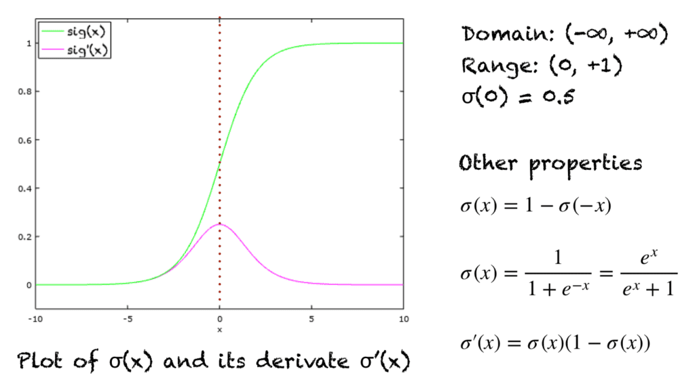

# Logistic Regression

## Sigmoid Function
Sigmoid function is a special form of the logistic function. It is like:

$$\sigma(x) = \frac{1}{1+e^{-x}}=\frac{e^x}{1+e^x}$$

## Logistic Regression Model

$$\hat{y}=\sigma(w^Tx+b)$$

## Loss (Error) Function

$$L(\hat{y},y)=-[ylog\hat{y}+(1-y)log(1-\hat{y})]$$

If $y=1$, $L(\hat{y},y)=-log\hat{y}$,
then we want $L$ is as small as possible, which means $\hat{y}$ is as large as possible. While $\hat{y}$ is an output of sigmoid function, so we want $\hat{y}$ is close to 1.

If $y=0$, $L(\hat{y},y)=-log(1-\hat{y})$,
then we want $L$ is as small as possible, which means $\hat{y}$ is as small as possible. While $\hat{y}$ is an output of sigmoid function, so we want $\hat{y}$ is close to 0.

Cost Function:
$$J(w,b)=\frac{1}{m}\sum_{i=1}^{m}L(\hat{y}^{(i)},y^{(i)})=-\frac{1}{m}\sum_{i=1}^{m}[y^{(i)}log\hat{y}^{(i)}+(1-y^{(i)})log(1-\hat{y}^{(i)})]$$

