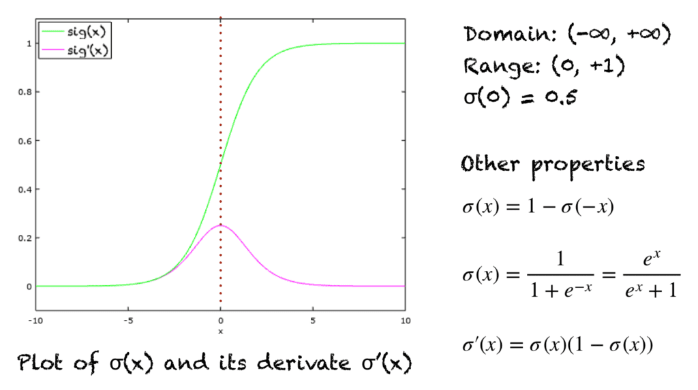
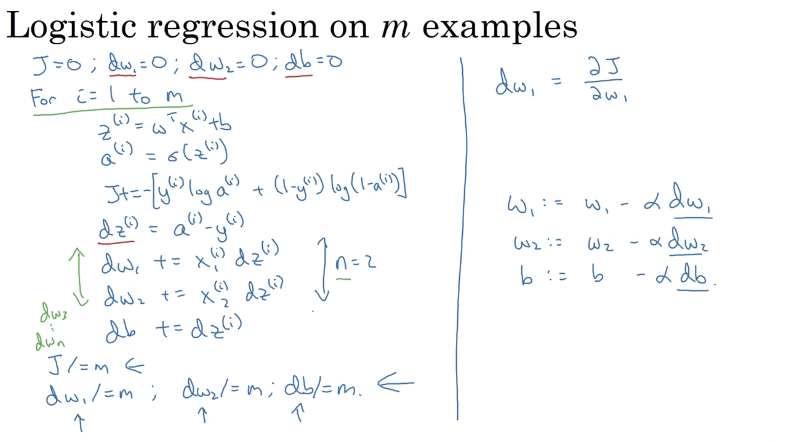

# Logistic Regression

## Sigmoid Function
Sigmoid function is a special form of the logistic function. It is like:

$$\sigma(z) = \frac{1}{1+e^{-z}}=\frac{e^z}{1+e^z}$$

## Logistic Regression Model

$$\hat{y}=\sigma(w^Tx+b)$$

## Loss (Error) Function:  for a single training example

$$L(\hat{y},y)=-[ylog\hat{y}+(1-y)log(1-\hat{y})]$$

If $y=1$, $L(\hat{y},y)=-log\hat{y}$,
then we want $L$ is as small as possible, which means $\hat{y}$ is as large as possible. While $\hat{y}$ is an output of the sigmoid function, so we want $\hat{y}$ is close to 1.

If $y=0$, $L(\hat{y},y)=-log(1-\hat{y})$,
then we want $L$ is as small as possible, which means $\hat{y}$ is as small as possible. While $\hat{y}$ is an output of the sigmoid function, so we want $\hat{y}$ is close to 0.

## Cost Function: of the estimated parameters, on the whole traning set

$$J(w,b)=\frac{1}{m}\sum_{i=1}^{m}L(\hat{y}^{(i)},y^{(i)})=-\frac{1}{m}\sum_{i=1}^{m}[y^{(i)}log\hat{y}^{(i)}+(1-y^{(i)})log(1-\hat{y}^{(i)})]$$

## Gradient Descent

We want to find $w, b$ that minimize $J(w, b)$. Here is an example that simplifies the situation.

Here is the gradient descent for one step based one single training sample.

One step for m samples:

## Vectorization

## From Binary to Multi-class classification

### One-vs-rest

### Multinomial probability distribution

## Weight of Evidence (WOE) and Information Value (IV)

## References

[1] Andrew Ng: Deep Learning