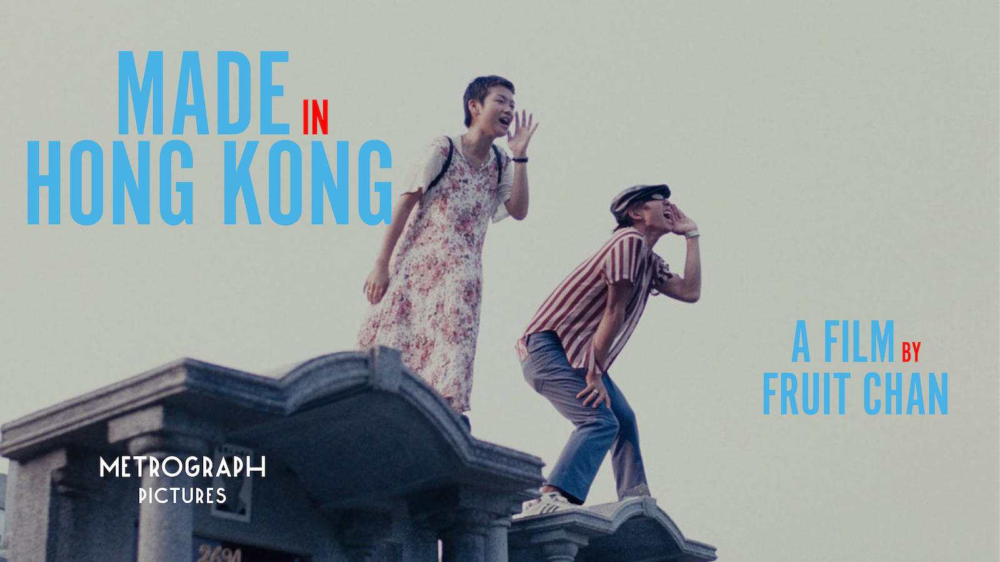

# Made in Hong Kong 香港制造

Trailer on Youtube:

<iframe width="100%" src="https://www.youtube.com/embed/Op4HBWPiDyU" title="YouTube video player" frameborder="0" allow="accelerometer; autoplay; clipboard-write; encrypted-media; gyroscope; picture-in-picture" allowfullscreen></iframe>

If you cannot play the video through the Youtube link for some reason, you can play it here:
<video width="100%" controls>
  <source src="https://github.com/yuchentang/yuchentang.github.io/blob/main/assets/images/Made_in_Hong_Kong_trailer_metrograph.mp4?raw=true" type="video/mp4">
</video>

## 说在前面

第一次知道陈果是从他的妓女三部曲开始的。

陈果像精心雕琢饱含对真实世界映射的艺术品的工匠，他疯狂的构造者着想要的情节、画面，努力寻找着抽象和具象的交集。这样的艺术品是难以有明显的致命伤的。

但雕饰感本身又是很可怕的东西，稍不留神甚至会很致命。少女Susan坠楼时的蓝色滤镜，白色和鲜红的血液，结尾的“世界是你们的，也是我们的，但是归根结底是你们的。你们青年人朝气蓬勃，正在兴旺时期，好像早晨八九点钟的太阳，希望寄托在你们身上”，隐喻含义逐渐强烈，如同《三夫》里的港珠澳大桥，几乎到了让人“生理不适”的地步。

## 香港·青年

这群青年是迷茫和天真的，他们甚至会堕入所谓的虚无主义；他们可以安于穿梭在墓地里游玩，他们不畏惧死亡，如同他们不畏惧死去的Susan；他们有天生的多管闲事的使命感，如同他们立志要把Susan的两封信物归原主；他们是怯懦的，李灿森不敢扣下扳机去执行刺杀任务；他们又是无畏的，中秋为了恋人可以奉献身体、为了兄弟而扣动扳机。

## 镜头

电影里有相当数量的仰拍镜头，例如李灿森得到真枪时的乱舞，又例如他们一行人奔跑在筒子楼的走廊上。

仰视的角度是不够自然的，这使得这部电影像对这群青年生活的特写但又是旁观，是一种审视的角度。并且，微微自下而上的角度产生了一种坠落感，像一个漩涡一样慢慢的把他们的生命拖入这个黑洞之中。

唐雨辰 

2022/07/29于纽约唐人街Metrograph
